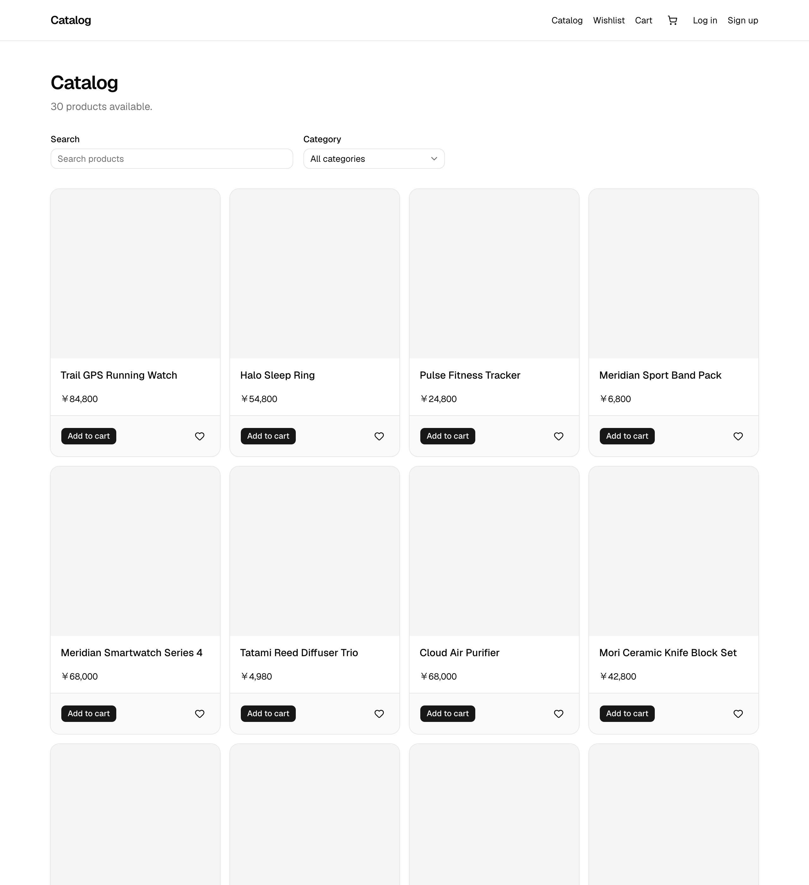
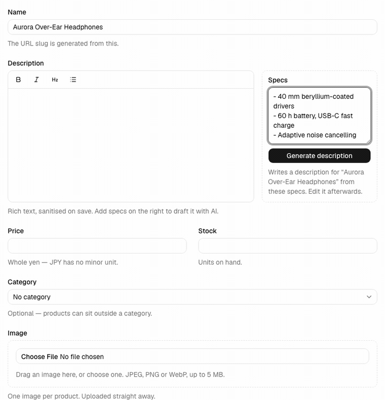

# E-commerce Catalog

[](https://github.com/febbryandika/ecommerce-catalog/actions/workflows/ci.yml)

A product catalog where admins manage inventory and customers browse, add to cart and save to a
wishlist — with the public pages server-rendered, because search engines and link previews are the
reason this stack was chosen.

**Live demo → <https://ecommerce-catalog-mauve-six.vercel.app>**

Sign in as either role. `pnpm db:seed` creates both accounts; they are demo credentials, published
on purpose — do not reuse this password anywhere that matters.

| Role     | Email                       | Password            |
| -------- | --------------------------- | ------------------- |
| Admin    | `demo-admin@example.com`    | `demo-password-123` |
| Customer | `demo-customer@example.com` | `demo-password-123` |

### Two open items, stated up front

- **The seed ships no product photography.** `seed/images/` holds only its naming contract, so
  every seeded product has a null `image_url` and the grid renders its placeholder tile. The
  upload path itself is proven in production — an admin upload lands in R2 and is served back
  through `/_next/image` — so what is missing is the photographs, not the feature. Drop files named
  after each slug into `seed/images/` and re-run the seed; it only ever fills a null `image_url`.
- **`revalidate = 60` does not engage on Vercel.** The product detail page exports it, but the
  deployment answers `cache-control: no-store` with `x-vercel-cache: MISS` on repeat requests, so
  the route is served fully dynamically. Ruled out so far: `generateStaticParams` (registers the
  route, does not change the behaviour), `src/proxy.ts`, and any `cookies()` / `headers()` call in
  the render tree. Open, and honest about being open.

## Screenshots



The public catalog. Search, category filter and pagination all live in the URL and are read
server-side from `searchParams`, so the grid is a Server Component that renders the same HTML for a
crawler as for a browser. Prices are formatted at the edge of the render with
`Intl.NumberFormat('ja-JP')`.



The admin description generator. Bullet specs go in on the right, `streamText()` returns a plain
text stream, and the client reads it with a `TextDecoder` and re-renders TipTap on every chunk. The
button is disabled for the duration — one generation at a time per admin — and the status line
beneath it announces through `aria-live`. The output is ordinary editable rich text afterwards.

## Features

- **Public catalog** — SSR grid with `ILIKE` name search, category filter and 24-per-page
  pagination; product detail pages with `generateMetadata()` for title, description and OG image.
- **Cart** — persisted in Postgres against the session user, quantity clamped to current stock in
  SQL at write time, and a sheet with live subtotal.
- **Wishlist** — one toggle Server Action, optimistically applied through TanStack Query and rolled
  back with a toast if the write fails.
- **Signed-out intent is never dropped** — an add-to-cart or wishlist click while logged out
  redirects to `/login?next=…&add=…` and replays exactly once after signing in.
- **Admin** — full product CRUD, publish/unpublish, and one image per product uploaded to
  Cloudflare R2 through the app so the credentials never reach the browser.
- **AI descriptions** — Claude writes marketing copy from the product name and bullet specs,
  streaming live into TipTap; the HTML is sanitised server-side on save.
- **States and accessibility** — 5 `loading.tsx`, 6 `error.tsx` and 2 `not-found.tsx` boundaries;
  distinct empty states for cart, wishlist, zero search results and an empty admin catalog;
  `aria-label` on every icon-only control; and the whole browse → product → cart flow completable
  with the keyboard alone, covered by an end-to-end test.

## Tech stack

| Area         | Choice                                  | Why                                                                                                |
| ------------ | --------------------------------------- | -------------------------------------------------------------------------------------------------- |
| App          | Next.js 16 App Router · React 19 · pnpm | Server Components render the SEO surface; Server Actions cover mutations without an API layer      |
| Language     | TypeScript                              | The price/stock/quantity arithmetic is exactly where a silent string-for-number would hurt         |
| UI           | Tailwind CSS v4 · shadcn/ui (Radix)     | Radix gives the cart sheet real focus trapping and `Esc` handling rather than a reimplementation   |
| Data         | PostgreSQL · Drizzle ORM · drizzle-kit  | SQL-shaped queries with generated, reviewable migrations — the stock clamp is written in SQL       |
| Auth         | Better Auth                             | Email + password with a `role` field the client cannot set, and a schema it generates into Drizzle |
| Client state | TanStack Query · Zustand                | Query owns server state and the optimistic rollback; Zustand only holds ephemeral panel state      |
| Validation   | Zod                                     | One schema per input, shared verbatim between the Server Action and the client form                |
| AI           | Vercel AI SDK · `@ai-sdk/anthropic`     | `streamText()` hands back a plain token stream, which is what the editor needs to append live      |
| Storage      | Cloudflare R2 via `@aws-sdk/client-s3`  | S3-compatible with no egress fees; the same client code would run against S3                       |
| Quality      | Vitest · Playwright · GitHub Actions    | Units for the pure logic, browser tests for everything that only exists once rendered              |

## Architecture decisions

The parts worth arguing about, and what each one costs.

### Next.js fullstack, not a separate API server

SSR product pages are the entire point of the project: a catalog lives or dies on being indexable
and painting fast. Putting a standalone Hono API in front of the database would be the right call
if a third-party client needed the catalog — a mobile app, a partner integration — but none does,
so it would buy a second deploy target, a second set of auth plumbing and a network hop between the
renderer and its data, in exchange for nothing anyone is asking for. A client-only SPA is the
opposite mistake: it throws away the server rendering that justified the stack in the first place.

**What that costs:** the catalog is not consumable by anything except this app. The queries live
inline in the route files, so exposing them later means extracting them into a service layer first
— cheap while there are three of them, and not something to pay for in advance.

### Price is an `integer` of yen

JPY has no minor unit, so there is no fraction to represent and nothing to round. That alone
justifies an integer, but the deciding factor was narrower: **Drizzle returns `numeric` columns as
JavaScript strings.** A `numeric` price would silently make `price * quantity` a string
concatenation somewhere in a subtotal, and that class of bug does not announce itself — it just
produces a wrong number. An `integer` column removes the rounding risk and the string/number
ambiguity at the same time, and formatting happens exactly once, at render, in
`src/lib/format.ts`.

**What that costs:** a second currency with cents is a migration, not a config change. That is the
right trade for a single-currency catalog, and the wrong one for a storefront that plans to expand.

### Mutations are Server Actions; the AI route is a Route Handler

A Server Action is the shortest correct path for a mutation — typed end to end, no endpoint to
name, no client fetch wrapper, no serialization contract to keep in sync. So every write goes
through one: cart, wishlist, and all of admin product CRUD.

A Route Handler earns its place only where a raw HTTP response is genuinely unavoidable, which is
three places: a token stream (`/api/ai/describe`), a multipart body (`/api/upload`), and Better
Auth's own handler. A Server Action cannot return a `ReadableStream` to a `fetch()` caller, and the
editor needs to read chunks as they land — so the AI route is a handler, not a stylistic preference.

The interesting part is the **exception, which was measured rather than reasoned**. The two
cart/wishlist _reads_ are also GET handlers, and they had to become handlers. A Server Action is a
POST that also returns the current route's RSC payload; using one as a TanStack Query `queryFn`
made every page POST to itself on mount, and a response still in flight when the user navigated was
applied on top of the _new_ page — re-inserting the previous route's `<meta name="description">`.
The visible symptom was two description tags after any client-side navigation, on the surface whose
SEO is the whole justification for this stack. Isolated by bisection: neither the client island nor
the query provider reproduced it alone; the Server-Action read did, and stubbing it out fixed it.
The shared query bodies now live in `src/lib/cart-queries.ts` and are called by both the route
handlers and the SSR pages, so there is one query, not two.

A consequence worth naming: `src/proxy.ts` guards `/admin/*`, but it is a cookie-presence check for
routing convenience and **cannot see the role**. Authorization is a separate concern, re-checked
inside every admin Server Action and Route Handler with `requireRole('admin')`. Those two helpers
also fail differently on purpose — `requireUser()` redirects, `requireRole()` throws, so a Route
Handler can answer 403 instead of 307-ing a `fetch()` into an HTML login page.

### Checkout is deliberately out of scope

Payment, orders and order history belong to a separate project. There is no `orders` table here and
no half-built checkout button behind a feature flag — the boundary is drawn at cart and wishlist so
that everything inside it is actually finished. A catalog with a working cart, correct stock
clamping and a real authorization story is worth more as a portfolio artifact than the same catalog
plus a Stripe form that only works in test mode.

**What that costs:** the demo stops at a populated cart. That is the intended ending, not a
truncation.

## Local setup

Needs **Node 22+** (`pnpm db:seed` runs on bare Node type-stripping), **pnpm 11.5.3** (pinned via
`packageManager`) and **Docker**.

```bash
pnpm install
cp .env.example .env          # then fill in the blanks
docker compose up -d          # Postgres 16 on 127.0.0.1:5437
pnpm db:migrate
pnpm db:seed                  # 5 categories, 31 products, 2 demo accounts
pnpm dev                      # http://localhost:3000
```

`BETTER_AUTH_SECRET` is the only variable nothing works without — generate one with
`openssl rand -base64 32`. `ANTHROPIC_*` and `R2_*` are optional: without them the description
generator and the image upload are the only things that stop working, the seed skips its image step
and still completes, and the two tests that need them skip themselves.

Postgres is published on **5437** rather than the default 5432 to avoid colliding with other local
databases. `DATABASE_URL` in `.env.example` already matches.

Or, to go straight to a green test run on a clean clone:

```bash
pnpm install
pnpm test:all                 # writes .env, starts Postgres, runs both suites
```

`pnpm test:all` creates `.env` from `.env.example` with a generated `BETTER_AUTH_SECRET` **only if
`.env` does not already exist** — it will never overwrite real keys.

## Testing and CI

```bash
pnpm test                     # Vitest — 121 unit cases across src/lib
pnpm test:coverage            # the same, with a coverage report
pnpm test:e2e                 # Playwright — 41 browser tests across e2e/
pnpm test:e2e:strict          # the same with no retries, for a flake audit
pnpm test:all                 # both suites from a clean clone, one command
```

Playwright needs its browser once: `pnpm exec playwright install chromium`.

Vitest covers the pure logic — Zod schemas, JPY formatting, the cart stock clamp, slug generation,
the search/pagination helpers and the HTML sanitiser. Playwright covers everything that only exists
once rendered: signup and role persistence, the browse → filter → cart → quantity → remove journey,
the wishlist toggle surviving a reload, the full admin create → upload → generate → publish flow, a
customer being turned away from `/admin`, the logged-out add-to-cart replay, the zero-results empty
state, and the keyboard-only path from the grid to the cart.

CI runs `lint → typecheck → format:check → vitest → playwright` on every pull request and on `main`,
against a Postgres service container, and asserts that a second `pnpm db:seed` reports `0 new`. It
deliberately sets no `R2_*` variables: the upload round-trip test skips itself, and a build with
them absent is what proves the S3 client in `src/lib/r2.ts` is constructed lazily rather than at
module load. The admin journey mocks R2 and Anthropic at the network boundary instead, so it still
runs there.

### The E2E database

Playwright never touches the database `pnpm dev` uses. It runs against `<your database>_test`
(override with `TEST_DATABASE_URL`), which `e2e/global-setup.ts` creates if needed, migrates,
empties and re-seeds **before every run**. Two consequences worth knowing:

- Every run starts from exactly what the seed writes — 5 categories, 31 products, 30 of them
  published, 2 demo accounts — no matter what the previous run left behind. The suite has no
  teardown by design, so without this the accounts and draft products pile up. On this machine the
  dev database had reached 579 accounts before the split.
- Anything you created by hand while developing is safe.

The suite also runs on port **3100**, not 3000, so another project's dev server cannot be adopted by
`reuseExistingServer` and quietly serve the tests the wrong app.

### Reading the coverage report

`pnpm test:coverage` prints a table and writes a browsable one to `coverage/index.html`.

| Column              | Means                                                       |
| ------------------- | ----------------------------------------------------------- |
| `% Stmts`           | statements executed                                         |
| `% Branch`          | branches taken — the column that catches an untested `else` |
| `% Funcs`           | functions called at least once                              |
| `Uncovered Line #s` | the part actually worth reading                             |

**Read the uncovered lines, not the percentage.** The report is scoped to `src/lib/**` — the pure
logic — and deliberately excludes the modules a node-environment unit suite cannot execute:
`auth.ts`, `auth-client.ts`, `cart-queries.ts`, `cart-client.ts`, `wishlist-client.ts` and
`use-hydrated.ts` are React hooks, Drizzle queries or `next/headers` callers, and Playwright covers
them instead. Including them would report a large red block that only says "the E2E suite tests
this".

There are no thresholds, and adding one would be the wrong move: the goal is to see what is
uncovered and judge whether it could silently produce wrong data, not to defend a number. `r2.ts`
sits at ~18% on purpose — `putProductImage` is a network call, and only `imageObjectKey` beside it
is unit-testable.

---

The rest of this file is reference material for working on the project.

## Accounts and roles

Sign up at `/signup`. Every account is created with the `customer` role — `role` is declared
`input: false` in the Better Auth config, so a client cannot assign itself `admin` at signup (there
is an end-to-end test that attempts exactly that). Admins are promoted by hand:

```sql
UPDATE "user" SET role = 'admin' WHERE email = 'you@example.com';
```

`src/proxy.ts` bounces anonymous visitors away from `/admin/*`, but it is only a cookie-presence
check for routing convenience — it cannot see the role. Authorization is enforced separately, via
`requireRole('admin')`: `src/app/admin/layout.tsx` redirects a signed-in customer back to the
catalog, and every admin Server Action re-checks the role independently, so a forged cookie or a
direct action call still gets nothing.

## Product images

One image per product, uploaded from the admin form to Cloudflare R2.

Set up a bucket before the upload works:

1. Create an R2 bucket, then enable its public **r2.dev** URL (or attach a custom domain).
2. Create an R2 **API token** scoped to _Object Read & Write_ on that bucket.
3. Fill `R2_ACCOUNT_ID`, `R2_ACCESS_KEY_ID`, `R2_SECRET_ACCESS_KEY`, `R2_BUCKET` and
   `R2_PUBLIC_URL` in `.env`, then **restart the dev server** — `next.config.ts` reads
   `R2_PUBLIC_URL` at boot to build `images.remotePatterns`, so an edit alone will not take.

The file is POSTed to `/api/upload`, which re-checks `requireRole('admin')` itself — `proxy.ts`
matches `/admin/:path*` only and never sees this route. It accepts JPEG, PNG and WebP up to 5 MB,
validated server-side regardless of the input's `accept` attribute, and stores each object under a
fresh cuid2 key so two uploads can never collide. Uploads go **through** the app rather than via
presigned direct-to-R2 URLs, which keeps the credentials server-side; they never reach the browser
bundle.

Two limits worth knowing rather than discovering:

- Replacing or deleting a product leaves its old object in the bucket. There is no cleanup job and
  no lifecycle rule — acceptable at this scale, but it is a real cost over time.
- `pnpm test:e2e` **skips** the upload round-trip test when `R2_BUCKET` is unset. The authorization
  and validation tests still run; only the live bucket write is gated.

## Seed data

`pnpm db:seed` fills an empty database with something worth looking at — 5 categories, 31 products
with real names and whole-yen prices, and the two demo accounts above. Stock is varied deliberately:
one product is out of stock and two sit in low single digits, so those states have something to
render. Five products carry full multi-paragraph descriptions, and one is left unpublished so the
admin list shows a draft while the public grid filters it out.

It is **idempotent**. Products conflict on `slug` and existing rows are left alone, which means a
re-run costs nothing and — deliberately — does not overwrite anything you changed while poking at
the demo. It seeds no cart or wishlist rows: a fresh visitor should find both empty.

Product photos are not committed. Drop them in `seed/images/`, named after each product's slug —
`seed/images/README.md` lists every expected filename. The script uploads what it finds to R2 under
a stable `seed/<slug>` key, so a photo is uploaded exactly once no matter how often you re-run; to
replace one, delete the object from the bucket first. A missing file is not an error, just a product
with no image, and every one of them is named in the summary line.

Without `R2_*` set the image step skips itself entirely and the seed still runs end to end — the
same gate `pnpm test:e2e` uses for its upload round-trip. Products seeded that way keep a null
`image_url`, and a later run with R2 configured fills it in.

Two things the script does that the app cannot:

- It writes the `user` and `account` rows directly, hashing the password with Better Auth's own
  scrypt. There is no HTTP request that can create an **admin** — `role` is declared `input: false`,
  so `/api/auth/sign-up/email` silently rewrites it to `customer`. This is the same promote-by-SQL
  route documented under "Accounts and roles".
- It talks to Postgres in plain SQL rather than through Drizzle. `pnpm db:seed` runs the script on
  bare Node type-stripping with no bundler, so tsconfig `paths` do not resolve and
  `src/db/schema.ts` — which imports `./auth-schema` without a file extension — cannot be loaded.
  Every import in `scripts/seed.ts` is a package specifier for that reason.

## Scripts

| Script                 | Purpose                                         |
| ---------------------- | ----------------------------------------------- |
| `pnpm dev`             | Dev server                                      |
| `pnpm build`           | Production build                                |
| `pnpm start`           | Serve the production build                      |
| `pnpm lint`            | ESLint (flat config; `next lint` is gone in 16) |
| `pnpm typecheck`       | `next typegen` then `tsc --noEmit`              |
| `pnpm format`          | Prettier write · `format:check` to verify       |
| `pnpm test`            | Vitest unit tests                               |
| `pnpm test:coverage`   | Vitest with a coverage report                   |
| `pnpm test:e2e`        | Playwright E2E                                  |
| `pnpm test:e2e:strict` | Playwright with no retries — flake audit        |
| `pnpm test:all`        | Everything, from a clean clone                  |
| `pnpm db:generate`     | Generate migrations from `src/db/schema.ts`     |
| `pnpm db:migrate`      | Apply migrations                                |
| `pnpm db:seed`         | Seed the demo catalog and accounts (idempotent) |

`typecheck` runs `next typegen` first because Next 16 generates `next-env.d.ts` and the typed route
helpers (`PageProps`, `LayoutProps`) into `.next/types` — neither is committed, so a bare
`tsc --noEmit` would fail on a fresh clone.

`playwright.config.ts` loads `.env` itself — the upload suite promotes its own throwaway account to
admin over the same database the app uses, the way an admin is made by hand.

## Deployment

Vercel, with a Neon Postgres database in `ap-southeast-1` and the functions pinned to `sin1` beside
it — the grid and detail pages query per request, so a cross-ocean hop would land on every render.
Hobby allows exactly one region.

`vercel.json` carries the whole configuration:

```json
{
  "buildCommand": "pnpm db:migrate && pnpm build",
  "ignoreCommand": "[ \"$VERCEL_ENV\" = production ] && exit 1 || exit 0"
}
```

Migrations run as part of the build rather than by hand, so a failed migration fails the deploy. The
`ignoreCommand` is inverted by Vercel's convention — **exit 0 skips the build, exit 1 proceeds** —
so anything that is not `VERCEL_ENV=production` is skipped, and a pull request branch can never run
`drizzle-kit` against the production database. CI already gates pull requests.

No secrets live in the repository. Every variable in `.env.example` is set as a Vercel environment
variable, with two deliberate differences: `BETTER_AUTH_SECRET` is generated fresh for production
rather than copied from local, and **`TEST_DATABASE_URL` is not set at all** — it exists only for
`e2e/global-setup.ts`, which drops and re-seeds whatever it points at.

### Sanitising in a serverless runtime

Descriptions are sanitised with `sanitize-html` rather than DOMPurify. DOMPurify needs a DOM, and
`isomorphic-dompurify` supplies one with jsdom — which sits on Next's default
`serverExternalPackages` list, so Turbopack leaves it as a runtime `require()` instead of bundling
it. jsdom now reaches the ESM-only `@exodus/bytes`, and Vercel's serverless runtime runs Node with
`require(esm)` disabled, so every page importing the sanitiser returned 500 in production while
working locally. Reproduce that locally with:

```bash
node --no-experimental-require-module -e "require('jsdom')"
```

`sanitize-html` parses instead of needing a DOM and is not on the external list, so it is bundled
and its own ESM dependencies resolve at build time.
